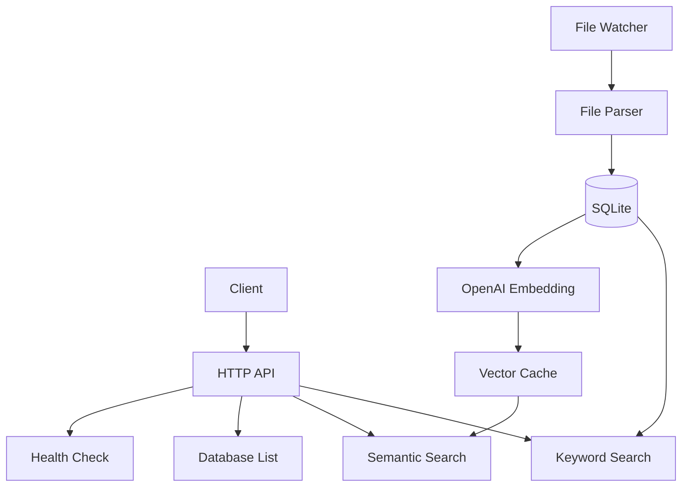

> [!NOTE]
> This README was generated by [SKILL](https://github.com/pardnchiu/skill-readme-generate), get the ZH version from [here](./doc/README.zh.md).

***

<strong>A READ-ONLY RAG DATABASE SERVICE — DROP FILES, SEARCH INSTANTLY</strong>

***

> A Go RAG database service with dual keyword and semantic search, filesystem watcher auto-indexing, and OpenAI embedding vector cache

## Table of Contents

- [Features](#features)
- [Architecture](#architecture)
- [License](#license)
- [Author](#author)
- [Stars](#stars)

## Features

> `go install github.com/agenvoy/kuradb/cmd/app@latest` · [Documentation](./doc/doc.md)

- **Keyword + Semantic Dual Search** — Combines Chinese tokenizer keyword matching with OpenAI embedding vector similarity search for both precision and semantic understanding.
- **Filesystem Watcher Auto-Indexing** — Drop files into a watched directory and they are automatically parsed, chunked, and embedded — no manual indexing needed.
- **Read-Only API Security Boundary** — Only query endpoints are exposed externally; all writes flow through the watcher → parser → SQLite unidirectional pipeline, preventing external tampering.
- **Vector Cache & Query Cache** — In-memory cosine similarity search paired with OpenAI query embedding cache delivers near-zero latency for repeated queries.
- **Single Binary Deployment** — A statically compiled Go binary with embedded SQLite, zero external dependencies, deployable with a single `go install`.

## Architecture

> [Full Architecture](./doc/architecture.md)

## License

This project is licensed under the [MIT LICENSE](LICENSE).

## Author

<h4 style="padding-top: 0">邱敬幃 Pardn Chiu</h4>

<a href="mailto:hi@pardn.io">hi@pardn.io</a> 
<a href="https://www.linkedin.com/in/pardnchiu">https://www.linkedin.com/in/pardnchiu</a>

***

©️ 2026 [邱敬幃 Pardn Chiu](https://www.linkedin.com/in/pardnchiu)
