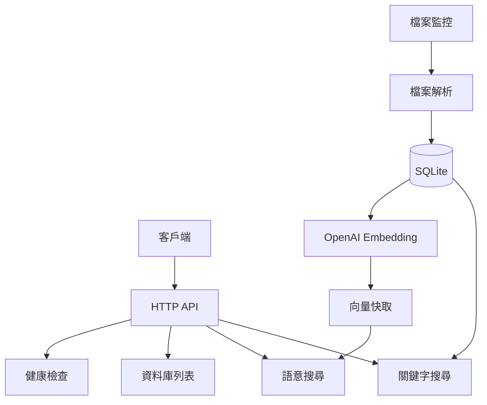

> [!NOTE]
> 此 README 由 [SKILL](https://github.com/pardnchiu/skill-readme-generate) 生成，英文版請參閱 [這裡](../README.md)。

***

<strong>A READ-ONLY RAG DATABASE SERVICE — DROP FILES, SEARCH INSTANTLY</strong>

***

> Go RAG 資料庫服務，具備關鍵字與語意雙重搜尋、檔案系統監控自動索引，以及 OpenAI embedding 向量快取

## 目錄

- [功能特點](#功能特點)
- [架構](#架構)
- [授權](#授權)
- [Author](#author)
- [Stars](#stars)

## 功能特點

> `go install github.com/agenvoy/kuradb/cmd/app@latest` · [完整文件](./doc.zh.md)

- **關鍵字 + 語意雙重搜尋** — 同時支援中文斷詞關鍵字比對與 OpenAI embedding 向量相似度搜尋，精準與語意兼顧。
- **檔案系統監控自動索引** — 將檔案放入監控目錄即自動解析、分段、嵌入，無需手動觸發索引流程。
- **唯讀 API 安全邊界** — 對外僅暴露查詢端點，所有寫入走 watcher → parser → SQLite 單向管線，杜絕外部竄改。
- **向量快取與查詢快取** — 記憶體內 cosine 相似度搜尋搭配 OpenAI query embedding 快取，重複查詢近乎零延遲。
- **單一二進位部署** — Go 編譯的靜態二進位檔，內嵌 SQLite，無外部依賴，`go install` 一鍵部署。

## 架構

> [完整架構](./architecture.zh.md)

## 授權

本專案採用 [MIT LICENSE](LICENSE)。

## Author

<h4 style="padding-top: 0">邱敬幃 Pardn Chiu</h4>

<a href="mailto:hi@pardn.io">hi@pardn.io</a> 
<a href="https://www.linkedin.com/in/pardnchiu">https://www.linkedin.com/in/pardnchiu</a>

## Stars

***

©️ 2026 [邱敬幃 Pardn Chiu](https://www.linkedin.com/in/pardnchiu)
