# KuraDB - Architecture

> Back to [README](../README.md)

## Overview

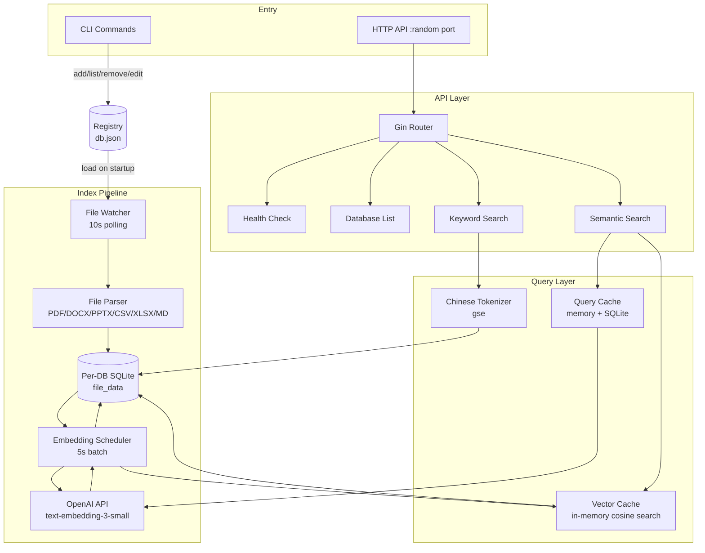

## Module: cmd/app (Entry Point)

`main.go` manages the full service lifecycle, initializing all subsystems in order.

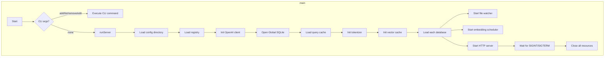

## Module: internal/api (HTTP API Layer)

A read-only REST API built on Gin, exposing only query endpoints.

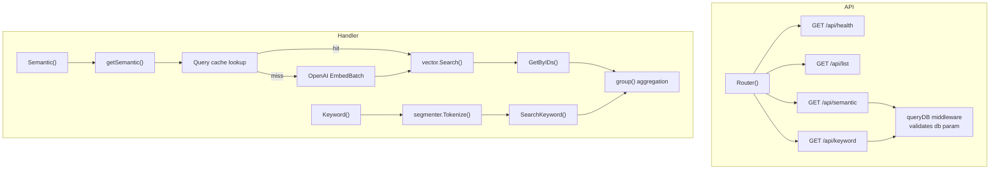

## Module: internal/database (Data Layer)

SQLite is the single source of truth, managed via `go-sqlkit` with read/write connection pooling.

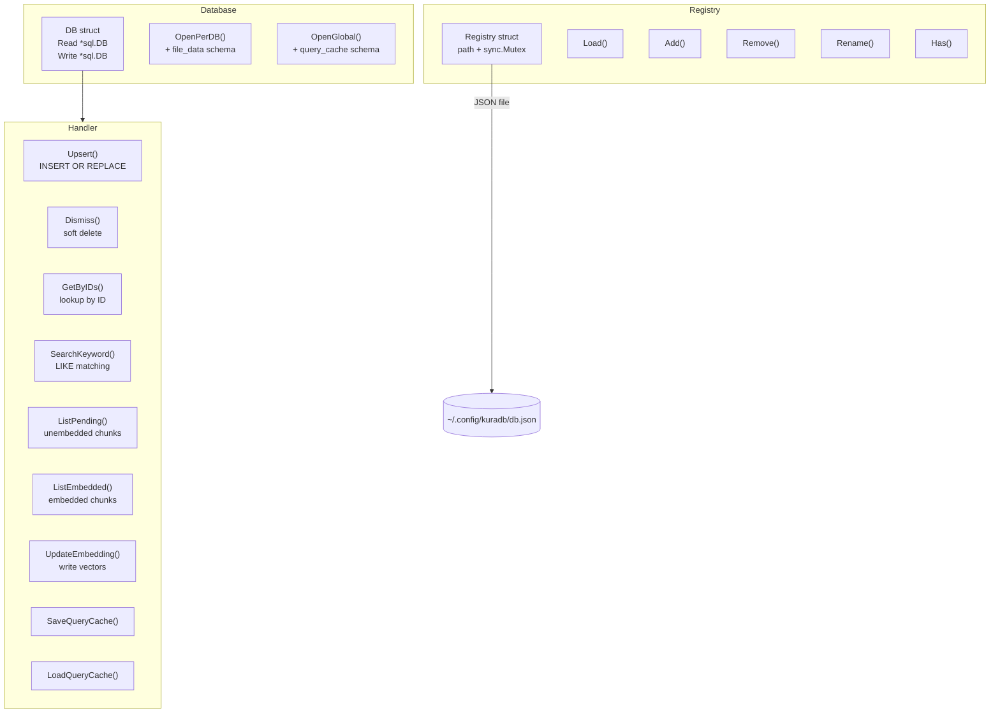

### file_data Schema

| Column | Type | Description |
|--------|------|-------------|
| `id` | INTEGER PK | Auto-increment primary key |
| `source` | TEXT NOT NULL | Source file path |
| `chunk` | INTEGER NOT NULL | Chunk index |
| `total` | INTEGER NOT NULL | Total chunks in file |
| `content` | TEXT NOT NULL | Chunk text content |
| `embedding` | BLOB | OpenAI vector (512-dim float32) |
| `is_embed` | BOOLEAN | Whether embedding is complete |
| `dismiss` | BOOLEAN | Soft delete flag |
| `created_at` | TIMESTAMP | Creation time |
| `updated_at` | TIMESTAMP | Last update time |

Unique constraint: `(source, chunk)`.

## Module: internal/filesystem (File Watching & Parsing)

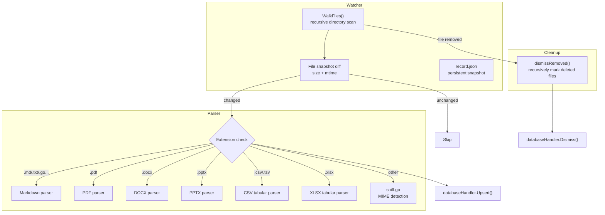

## Module: internal/openai (Embedding Client)

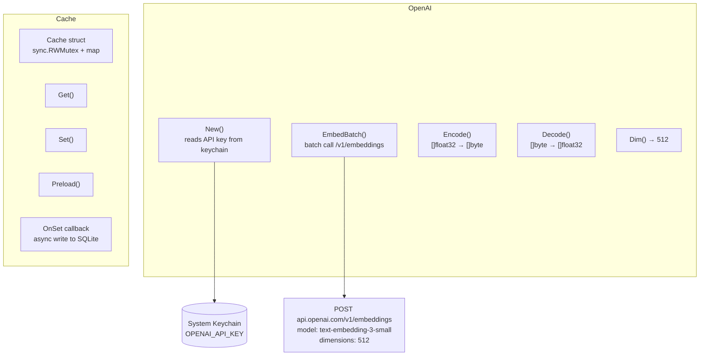

## Module: internal/vector (Vector Cache & Search)

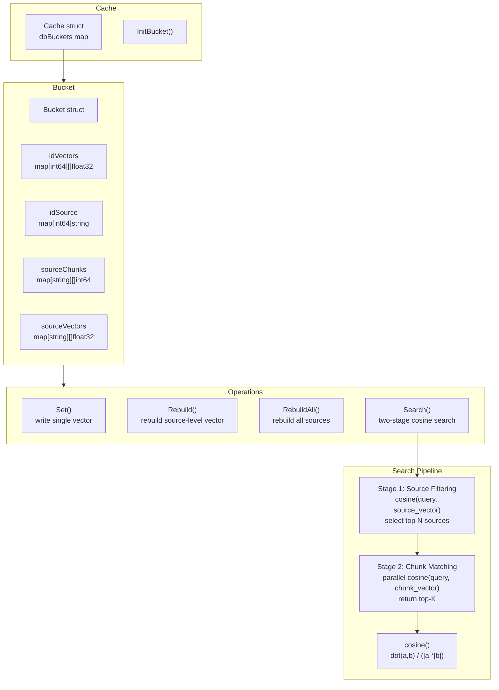

## Module: internal/utils/segmenter (Chinese Tokenizer)

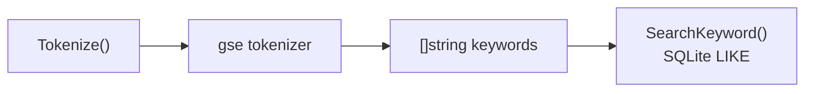

## Data Flow: File Indexing

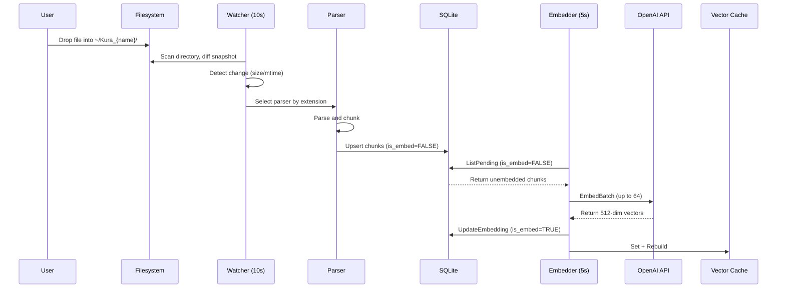

## Data Flow: Semantic Search

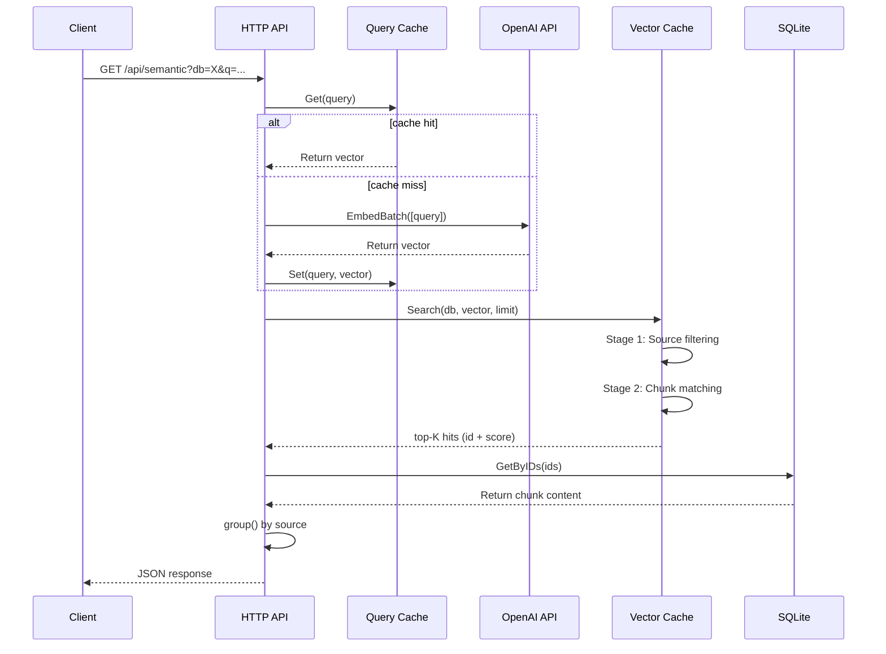

## State Machine: File Lifecycle

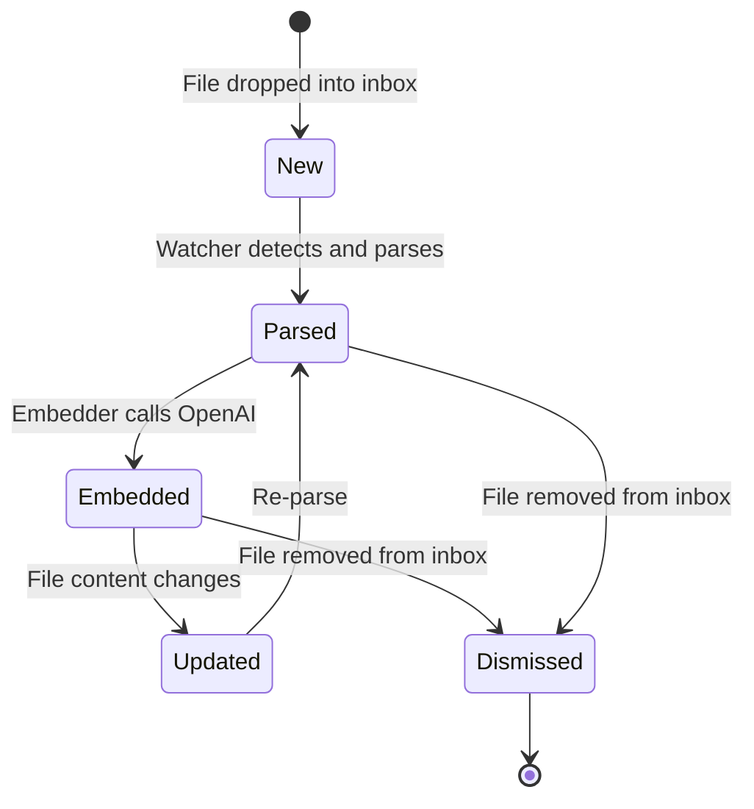

***

©️ 2026 [邱敬幃 Pardn Chiu](https://www.linkedin.com/in/pardnchiu)