# KuraDB - 架構

> 返回 [README](./README.zh.md)

## 概覽

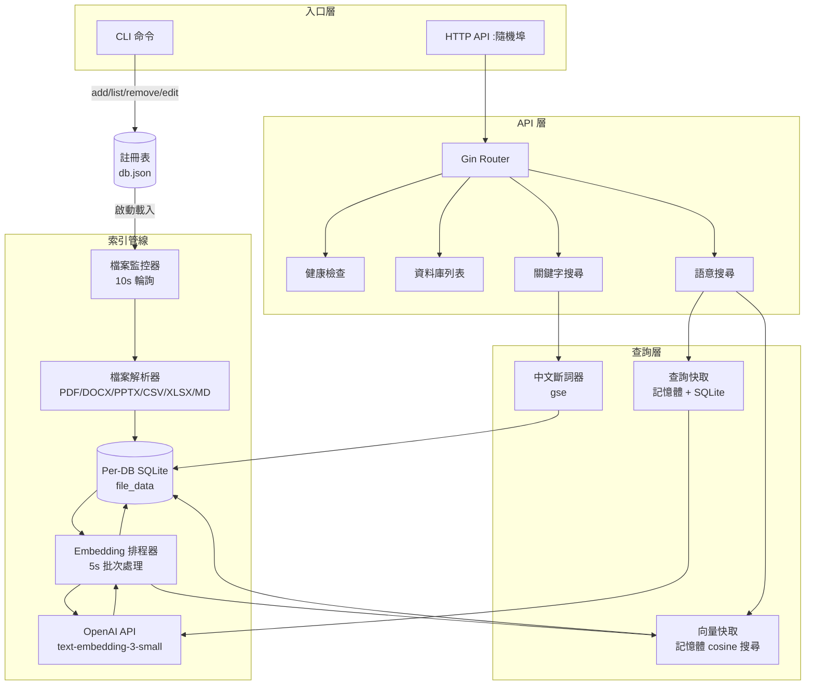

## 模組：cmd/app（入口點）

`main.go` 為整個服務的生命週期管理者，負責依序初始化所有子系統。

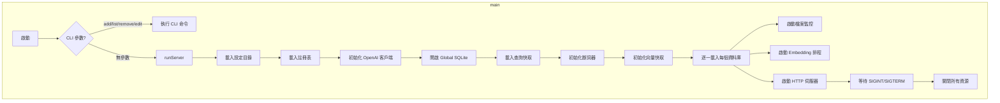

## 模組：internal/api（HTTP API 層）

基於 Gin 框架的唯讀 REST API，僅暴露查詢端點。

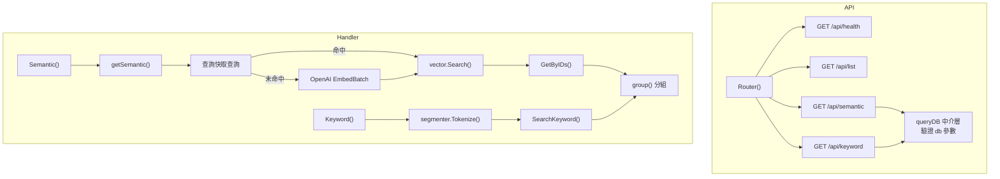

## 模組：internal/database（資料層）

SQLite 為唯一資料源，透過 `go-sqlkit` 管理讀寫分離連線池。

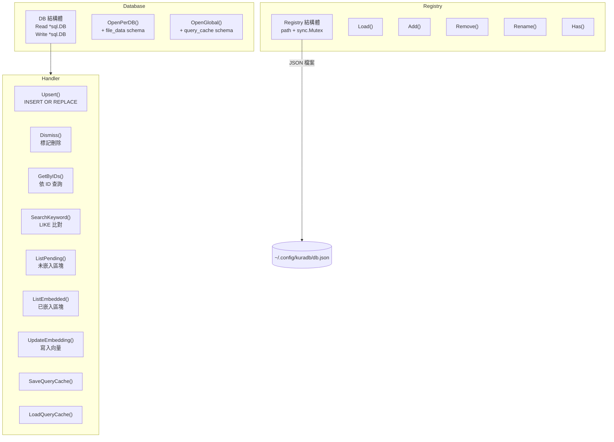

### file_data 結構

| 欄位 | 型別 | 說明 |
|--------|------|-------------|
| `id` | INTEGER PK | 自動遞增主鍵 |
| `source` | TEXT NOT NULL | 來源檔案路徑 |
| `chunk` | INTEGER NOT NULL | 區塊編號 |
| `total` | INTEGER NOT NULL | 該檔案總區塊數 |
| `content` | TEXT NOT NULL | 區塊文字內容 |
| `embedding` | BLOB | OpenAI 向量（512 維 float32） |
| `is_embed` | BOOLEAN | 是否已完成嵌入 |
| `dismiss` | BOOLEAN | 軟刪除標記 |
| `created_at` | TIMESTAMP | 建立時間 |
| `updated_at` | TIMESTAMP | 更新時間 |

唯一約束：`(source, chunk)`。

## 模組：internal/filesystem（檔案監控與解析）

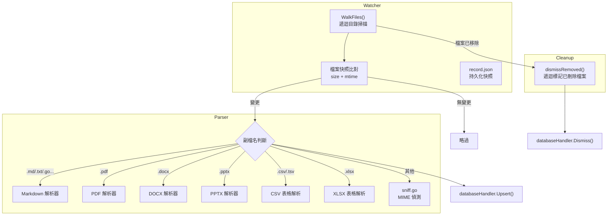

## 模組：internal/openai（Embedding 客戶端）

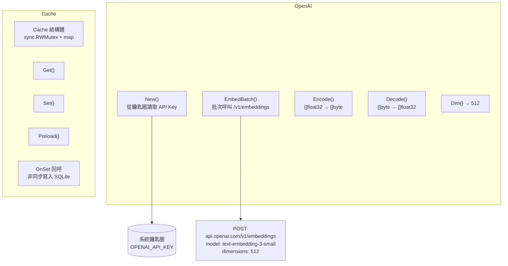

## 模組：internal/vector（向量快取與搜尋）

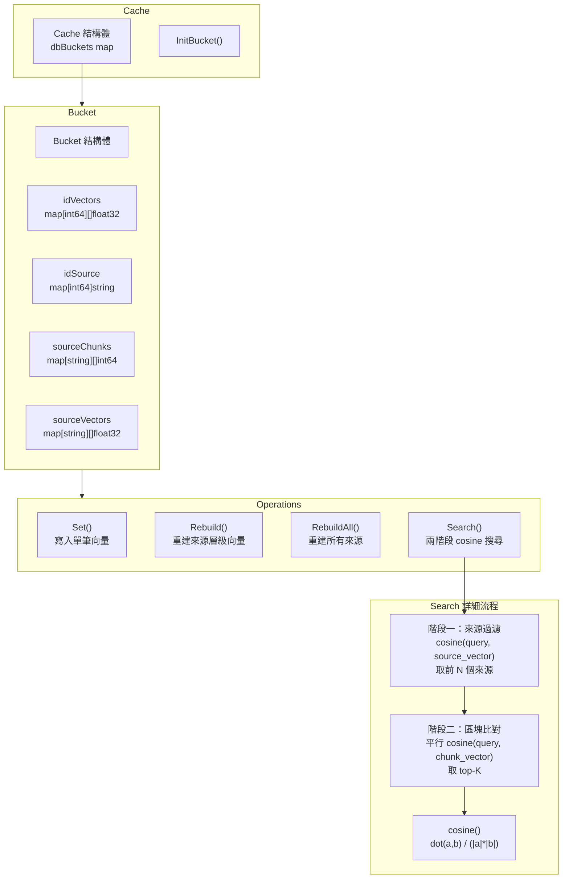

## 模組：internal/utils/segmenter（中文斷詞）

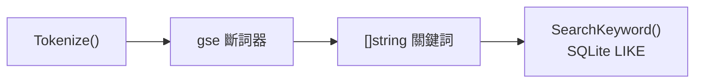

## 資料流：檔案索引

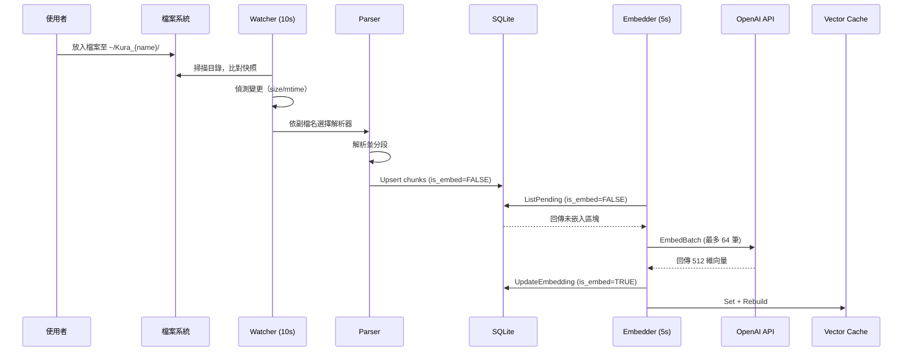

## 資料流：語意搜尋

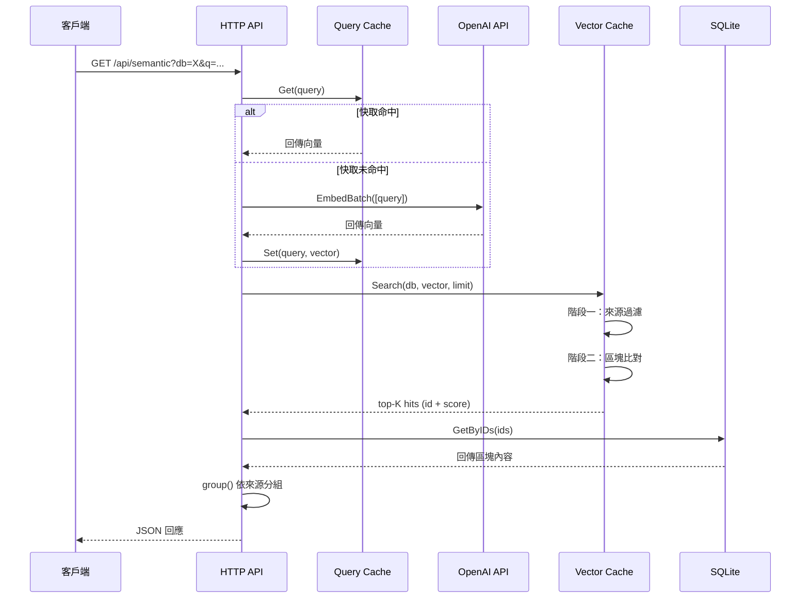

## 狀態機：檔案生命週期

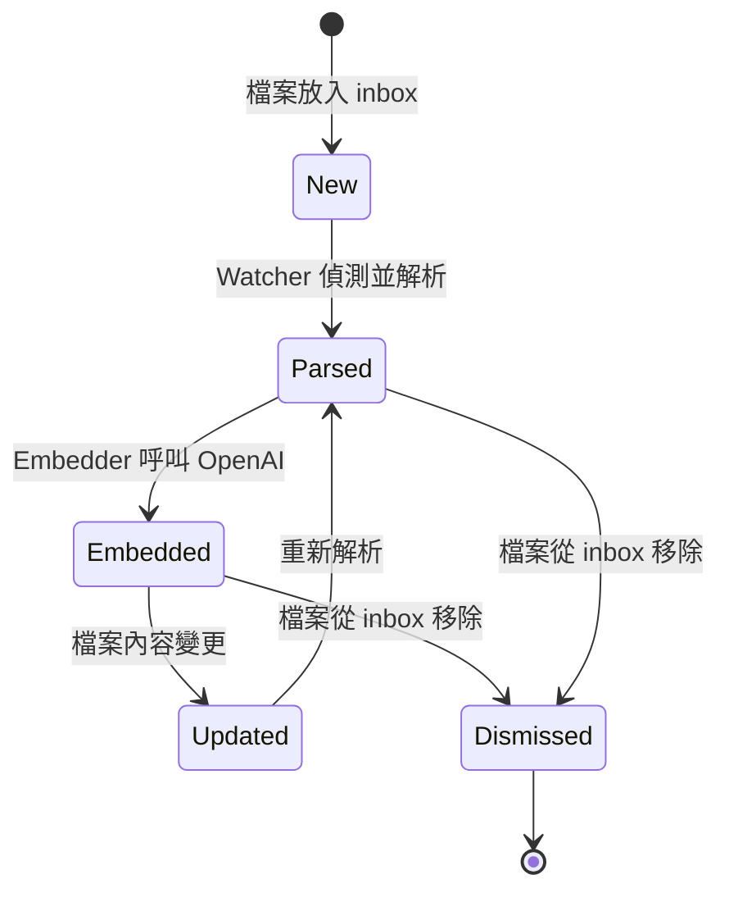

***

©️ 2026 [邱敬幃 Pardn Chiu](https://www.linkedin.com/in/pardnchiu)